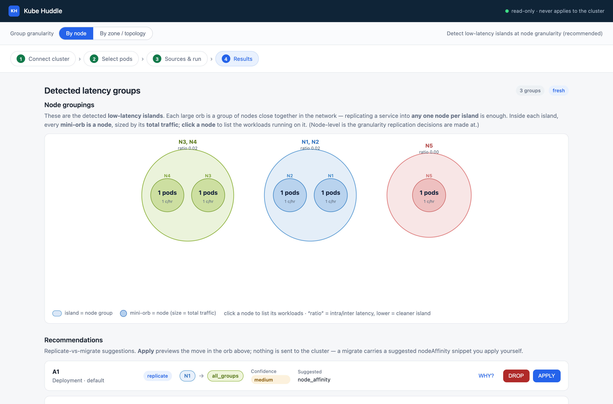
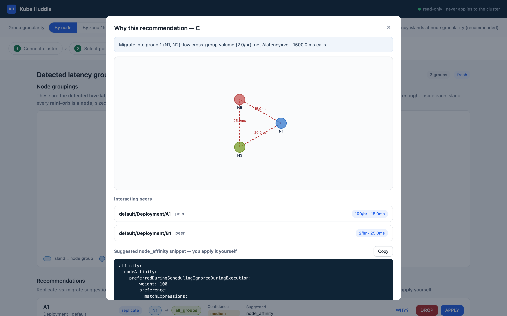

# Kube Huddle

**Apps that talk should live close. Huddle finds the low-latency huddles in your cluster from real traffic — then tells you where to replicate or migrate services to keep the huddle tight.**

Networks inside a Kubernetes cluster aren't necessarily flat. A pod on `node-a` and
a pod on `node-b` in the same zone might see 1 ms between them; the same pod pair 
across zones might see 25 ms. Zones are an exaggerated example, but there are several
latency other sources as well - such as across data centers, network NICs, hardware QoS, etc

Most of the time you don't notice, because you don't measure it - since only some random 
requests pay this tax, depending on which nodes the host and destination pods are running.
The more sparse your nodes are, more this unpredictability is. Kube Huddle *looks* at 
the calls your apps already make, groups your nodes by the latency between them, and 
tells you where each service belongs.

Kube Huddle reads your existing telemetry (Cilium/Hubble, Istio, OTel, or
mesh-style Prometheus histograms) and gives you two kinds of output:

1. **Low-latency node groups (showback)** — _"Your 12 nodes are actually 3
   islands. `frontend-a1..a3` are one huddle at ~1 ms internal; `db-a`, `db-b`
   are another at ~2 ms; there's a 25 ms barrier between them."_
2. **Replicate-vs-migrate recommendations** — _"`checkout` talks 100×/hr to
   `payments` at 15 ms but only 2×/hr across the barrier. Migrate it into the
   `payments` island; here's the copy-pasteable nodeAffinity."_

**It never touches your cluster.** Read-only credentials, no mutating admission
webhooks, no operator. Just guidance.

<p align="center">
  
</p>

## Two outputs, one analysis pipeline

Both outputs come from a four-stage engine that rebuilds the network's
real shape from the calls your workloads make:

1. **Smooth** each interaction pair's latency series (exponential smoothing;
   α + window are config-driven).
2. **Weigh** cross-node latency into an undirected node graph — edge weight =
   mean smoothed latency across the app pairs that cross that node boundary.
3. **Group** nodes into islands via greedy growth + a *latency-ratio* exact
   cover (lower ratio = cleaner island).
4. **What-if** replicate-vs-migrate + cost — for each candidate workload,
   is its cross-group traffic low enough that a migration would strictly
   reduce `Σ(volume × latency)` while saving replicas?

The **showback** view surfaces stages 1–3. The **recommendations** feed comes
out of stage 4. DaemonSets are excluded from candidacy end-to-end — they
already run everywhere, so replicate/migrate doesn't apply to them.

### Low-latency node groups

For every pair of nodes that host workloads which talk to each other:

- Smooth the pair's latency series (α · latest + (1−α) · moving avg of last `i`).
- Average across all app-pairs crossing those two nodes → one weight per edge.
- Grow candidate groups by greedy least-weight expansion; pick the exact cover
  minimizing `Σ (internal latency / external latency)`.

**Example output** (`sparse_migration` fixture, 3 islands from 5 nodes):

```
cover:
  (N3,N4)  ratio=0.0154
  (N1,N2)  ratio=0.0182
  (N5)     ratio=0.0000
total ratio = 0.0336
```

The [UI orb](docs/images/hero-orb.png) draws each island as a translucent
circle; every mini-orb inside is a node sized by its total traffic; click a
node to list its workloads.

### Replicate-vs-migrate recommendations

For each candidate workload (DaemonSets excluded, since they are supposed to run per node):

- **Default: replicate** — one instance per island the workload interacts with.
- **Migrate** — when the workload's cross-group traffic is small enough that
  moving into its dominant peer's island doesn't worsen total network time and
  cuts a replica.

Every migrate rec surfaces `latency_delta_ms`, `cost_saving`, `confidence`,
and a **copy-pasteable `nodeAffinity` snippet** keyed to the target island's
nodes. **You** apply it; the tool never does.

<p align="center">
  
</p>

## Try it in 5 minutes (no cluster needed)

The engine ships a synthetic-cluster generator, so you can go from zero to
recommendations without a Kubernetes cluster, without Prometheus, without Hubble:

```bash
# Engine — install
cd engine
python3 -m venv .venv && ./.venv/bin/pip install -e ".[dev]"

# 1) seed a synthetic 5-node/3-island cluster into ./demo.db
./.venv/bin/kubehuddle-engine init-db --db-dsn ./demo.db
./.venv/bin/kubehuddle-engine seed    --db-dsn ./demo.db --fixture sparse_migration

# 2) run the pipeline: smooth → weigh → group → whatif
./.venv/bin/kubehuddle-engine run --db-dsn ./demo.db --cluster sparse_migration

# 3) serve the API + UI, then walk the wizard at http://localhost:8000/
KUBEHUDDLE_UI_DIR=../ui KUBEHUDDLE_DB_DSN=./demo.db \
    ./.venv/bin/python -m uvicorn engine.api.app:app --port 8000
```

Walk-through with screenshots: [**docs/quickstart.md**](docs/quickstart.md).

## Deploy to Kubernetes

Container images + a Helm chart that runs the collector CronJob, engine + API,
UI, and an optional bundled Postgres:

```bash
./scripts/build-images.sh              # builds kubehuddle/{collector,engine,ui}:0.1.0
helm upgrade --install kubehuddle deploy/helm/kubehuddle/ \
    -n kubehuddle --create-namespace
kubectl -n kubehuddle port-forward svc/kubehuddle-ui 8080:80
# open http://localhost:8080/
```

Full guide (external Postgres, ingress, kind/minikube, RBAC): [**docs/deployment.md**](docs/deployment.md).

## Prerequisites

- **Go ≥ 1.23** (to build the collector) and **Python ≥ 3.9** (to run the engine).
- No Kubernetes cluster is needed to try it — the engine ships a synthetic
  generator and uses SQLite by default. Postgres is the production backend.

## Deeper reading

- [**Quickstart**](docs/quickstart.md) — the 5-minute walk-through, with the
  full synthetic → analyze → serve → API loop.
- [**Deployment guide**](docs/deployment.md) — Helm chart, kind/minikube demo,
  ingress, external Postgres, RBAC.
- [**Architecture**](docs/architecture.md) — the three modules, the shared
  analysis core, the four pipeline stages, the state-DB contract.
- [**REST API reference**](docs/api.md) — full `/api/v1` surface with DTOs.
- [**Node groups deep dive**](docs/node-groups.md) — how the algorithm builds
  the node graph, grows candidate groups, and picks the exact cover; the
  cost/latency model that produces migrate recs; the nodeAffinity snippet.
- [**Contributing**](docs/contributing.md) — how to run tests, keep the
  contracts stable, and open a PR.

Module-level readmes: [`collector/`](collector/README.md), [`engine/README.md`](engine/README.md),
[`ui/README.md`](ui/README.md), [`deploy/`](deploy/README.md).

<details>
<summary><b>REST API — quick reference</b></summary>

Base path `/api/v1` (served by `kubehuddle-engine serve`):

| Method | Path | What it does |
|---|---|---|
| `POST` | `/runs` | start a run: `{cluster, scope, config?, ttl?, run_type?}` → `{run_id, name, status, groups, recommendations}`. `run_type` defaults to `"latency"` |
| `GET`  | `/runs` | run history (each entry surfaces `run_type`, `stale`, `data_as_of`) |
| `GET`  | `/runs/{id}` | run status + freshness |
| `GET`  | `/runs/{id}/groups` | detected islands (`LatencyGroupDTO[]`) — feeds the orb |
| `GET`  | `/runs/{id}/graph` | the weighing-engine graph (`GraphDTO`) — nodes + edges with `internal|external` kind |
| `GET`  | `/runs/{id}/recommendations` | recommendation cards (`LatencyRecommendationDTO[]`) |
| `GET`  | `/runs/{id}/recommendations/{recId}/evidence` | the "why": subgraph + before/after detail + interacting peers |
| `GET/POST/DELETE` | `/clusters`, `/clusters/{id}` | manage connected clusters (name, api_url, auth_method, credential_ref) |
| `POST` | `/clusters:test`, `/clusters/{id}:test` | live cluster connectivity probe (kubeconfig / SA token / client cert / basic auth) |
| `GET`  | `/clusters/{id}/namespaces`, `.../workloads` | browse discovered workloads from the cache |
| `GET/POST/PUT/DELETE` | `/clusters/{id}/data_sources`, `/data_sources/{id}` | manage interaction/latency + cost sources |
| `GET/PUT` | `/settings` | default thresholds and data-retention windows |
| `POST/GET` | `/collections`, `/collections/{id}` | trigger + poll on-demand collection |

Full reference with DTOs, request bodies, and error shapes: [**docs/api.md**](docs/api.md).

</details>

## Status

**Working today** (verified end-to-end on the bundled synthetic fixture):

- Collector's Prometheus metrics + interactions + Cilium/Hubble latency ingest paths.
- Kubernetes discover step — namespaces, workloads with `kind` recorded (DaemonSet exclusion), pods with `nodeName` recorded.
- Full four-stage engine: smooth (with auto-α + `i_unit`), weigh (DaemonSet edges excluded), group (exact + greedy cover modes), whatif (replicate-vs-migrate with cost + nodeAffinity snippet emission).
- Deterministic recommendation feed with `latency_delta_ms`, `cost_saving`, and a copy-pasteable YAML snippet on every migrate.
- Complete `/api/v1` surface: `POST /runs` runs the pipeline; `GET /runs/{id}/{groups,graph,recommendations}` + `/evidence` return the exact DTOs the UI consumes.
- Static web UI: cluster wizard → workload tree (DaemonSets auto-excluded) → smoothing controls → orb showback + wide recommendation rows + Why force-graph modal. APPLY/DROP are strictly client-side preview.
- Live cluster connectivity probe (`/clusters:test`) — kubeconfig, SA token, client cert, and basic auth via k8s Secret references.
- On-demand collection via the collector's trigger service.
- Container images + a Helm chart for Kubernetes (bundled Postgres or external DB via `existingSecret`).

**Not built yet:**

- **Real OpenCost `CostProvider` wired via `POST /runs`.** The engine accepts a
  `cost_provider` callable at the Python layer; the HTTP path doesn't plumb one
  through yet. Cost fields are `null` until this lands.
- **Live discovery refresh.** `GET /clusters/{id}/namespaces?refresh=true`
  returns 501; the workload tree currently reads from the cache the collector
  populates.
- **Grouping by topology labels.** The `By zone / topology` toggle in the UI
  maps to `config.group_by`, but the engine's placement resolver still
  collapses by `node_name` — a follow-up needs to honour a topology key.
- **Semantic zoom on the orb.** Clicking an island to expand it and label every
  workload — the reference lives in `design/orb-options.html` Option D.

## Contributing

Bug reports and PRs welcome — see [**docs/contributing.md**](docs/contributing.md) for
the mechanics. Two things worth knowing:

- **Tests stay green.** Engine: `cd engine && ./.venv/bin/pytest`. Collector:
  `cd collector && go test ./...`.
- **Contracts.** The database schema is the only cross-module contract — the
  `collector/internal/store/migrations/` files are load-bearing. `/api/v1` DTOs
  are the other contract; keep them stable if you add a second recommender head.

## License

MIT — see [`LICENSE`](LICENSE). Permissive: commercial use, private forks,
SaaS hosting, and academic/research use are all allowed. Downstream users must
keep the copyright notice and the license text.
